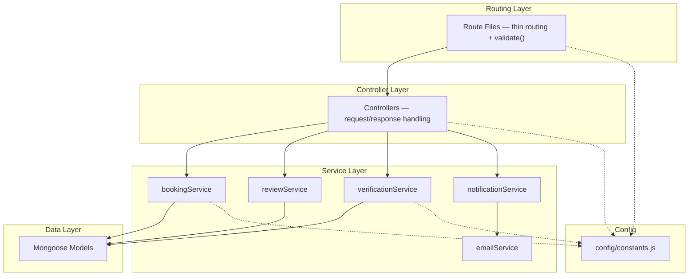

# Backend Refactoring — Phases 1–4 Complete

## Summary

Refactored the StaySafe backend across 4 phases: foundation utilities, MVC controller extraction, domain service layer, and config/validation. Eliminated ~4,000 lines of duplicated code and consolidated all magic numbers.

---

## Phase 1 — Foundation

| Change | File |
|--------|------|
| [asyncHandler](file:///c:/Users/mukun/Downloads/staysafe/Backend/src/utils/asyncHandler.js#1-10) utility | [asyncHandler.js](file:///c:/Users/mukun/Downloads/staysafe/Backend/src/utils/asyncHandler.js) |
| [ApiResponse](file:///c:/Users/mukun/Downloads/staysafe/Backend/src/utils/ApiResponse.js#10-70) helper | [ApiResponse.js](file:///c:/Users/mukun/Downloads/staysafe/Backend/src/utils/ApiResponse.js) |
| Global error middleware | [server.js](file:///c:/Users/mukun/Downloads/staysafe/Backend/src/server.js#L83-L91) |

---

## Phase 2 — Controller Extraction

| Route File | Lines Reduced | Controller |
|-----------|:---:|------------|
| [bookingRoutes.js](file:///c:/Users/mukun/Downloads/staysafe/Backend/src/routes/bookingRoutes.js) | 837 → 23 | [bookingController.js](file:///c:/Users/mukun/Downloads/staysafe/Backend/src/controllers/bookingController.js) |
| [chatRoutes.js](file:///c:/Users/mukun/Downloads/staysafe/Backend/src/routes/chatRoutes.js) | 727 → 28 | [chatController.js](file:///c:/Users/mukun/Downloads/staysafe/Backend/src/controllers/chatController.js) |
| [roommateRoutes.js](file:///c:/Users/mukun/Downloads/staysafe/Backend/src/routes/roommateRoutes.js) | 632 → 30 | [roommateController.js](file:///c:/Users/mukun/Downloads/staysafe/Backend/src/controllers/roommateController.js) |
| [documentRoutes.js](file:///c:/Users/mukun/Downloads/staysafe/Backend/src/routes/documentRoutes.js) | 581 → 58 | [documentController.js](file:///c:/Users/mukun/Downloads/staysafe/Backend/src/controllers/documentController.js) |
| [agreementRoutes.js](file:///c:/Users/mukun/Downloads/staysafe/Backend/src/routes/agreementRoutes.js) | 512 → 20 | [agreementController.js](file:///c:/Users/mukun/Downloads/staysafe/Backend/src/controllers/agreementController.js) |
| [reviewRoutes.js](file:///c:/Users/mukun/Downloads/staysafe/Backend/src/routes/reviewRoutes.js) | 463 → 25 | [reviewController.js](file:///c:/Users/mukun/Downloads/staysafe/Backend/src/controllers/reviewController.js) |

---

## Phase 3 — Service Layer

### [bookingService.js](file:///c:/Users/mukun/Downloads/staysafe/Backend/src/services/bookingService.js)

| Function | Duplication Eliminated |
|----------|----------------------|
| [syncRoomAvailability()](file:///c:/Users/mukun/Downloads/staysafe/Backend/src/services/bookingService.js#90-151) | ~30-line block × 3 sites |
| [coerceMealsSelected()](file:///c:/Users/mukun/Downloads/staysafe/Backend/src/services/bookingService.js#6-31) | ~15-line block × 2 sites |
| [meetsBookingVerification()](file:///c:/Users/mukun/Downloads/staysafe/Backend/src/services/bookingService.js#69-89) | ~10-line block × 1 site |

### [reviewService.js](file:///c:/Users/mukun/Downloads/staysafe/Backend/src/services/reviewService.js)

| Function | Duplication Eliminated |
|----------|----------------------|
| [getReviewsWithDistribution()](file:///c:/Users/mukun/Downloads/staysafe/Backend/src/services/reviewService.js#19-74) | ~30-line pipeline × 2 sites |

### [verificationService.js](file:///c:/Users/mukun/Downloads/staysafe/Backend/src/services/verificationService.js)

| Function | Duplication Eliminated |
|----------|----------------------|
| [updateVerificationState()](file:///c:/Users/mukun/Downloads/staysafe/Backend/src/services/verificationService.js#27-72) | ~30-line state transition block |
| [markVerificationFailed()](file:///c:/Users/mukun/Downloads/staysafe/Backend/src/services/verificationService.js#73-91) | Inline user update |
| [getDocumentCategory()](file:///c:/Users/mukun/Downloads/staysafe/Backend/src/services/verificationService.js#3-26) | Local helper moved to shared |

---

## Phase 4 — Validation & Config

### [config/constants.js](file:///c:/Users/mukun/Downloads/staysafe/Backend/src/config/constants.js)

Centralized 7 categories of magic numbers, all env-var overridable:

| Category | Key Constants | Consumers Wired |
|----------|--------------|----------------|
| `AUTH` | `JWT_EXPIRES_IN` | [authRoutes.js](file:///c:/Users/mukun/Downloads/staysafe/Backend/src/routes/authRoutes.js) |
| `UPLOADS` | `MAX_FILE_SIZE`, `ALLOWED_DOCUMENT_TYPES` | [documentRoutes.js](file:///c:/Users/mukun/Downloads/staysafe/Backend/src/routes/documentRoutes.js) |
| `VERIFICATION` | `EXPIRY_DAYS`, `TOKEN_EXPIRY_HOURS` | [bookingService.js](file:///c:/Users/mukun/Downloads/staysafe/Backend/src/services/bookingService.js), [verificationRoutes.js](file:///c:/Users/mukun/Downloads/staysafe/Backend/src/routes/verificationRoutes.js) |
| `ROOMMATE` | `REQUEST_COOLDOWN_DAYS`, `REQUEST_EXPIRY_DAYS` | [RoommateRequest.js](file:///c:/Users/mukun/Downloads/staysafe/Backend/src/models/RoommateRequest.js) |
| `AI` | `GROQ_MODEL`, `TEMPERATURE`, `MAX_TOKENS` | [chatbotRoutes.js](file:///c:/Users/mukun/Downloads/staysafe/Backend/src/routes/chatbotRoutes.js) |
| `PAGINATION` | `DEFAULT_LIMIT`, `MAX_LIMIT` | Available for future use |

### [middleware/validate.js](file:///c:/Users/mukun/Downloads/staysafe/Backend/src/middleware/validate.js)

Zero-dependency validation factory with 5 pre-built rule sets:

| Rule Set | Route Protected | Key Validations |
|----------|----------------|-----------------|
| `bookingRules` | `POST /bookings/book/:id` | MongoId, dates, endDate > startDate |
| `reviewRules` | `POST /reviews` | rating 1–5, comment max 2000, bookingId or messSubscriptionId required |
| `agreementCreateRules` | `POST /agreements/create` | MongoId, positive numbers, notice 1–365 |
| `adminVerifyDocumentRules` | `PATCH /documents/admin/verify/:id` | status enum, rejectionReason if rejected |
| `documentUploadRules` | Available for future use | documentType required |

---

## Verification

All endpoints verified after Phase 4:

| Endpoint | Status |
|----------|--------|
| `GET /api/mess` | 200 ✅ |
| `GET /api/bookings` | 401 ✅ |
| `GET /api/reviews/property/:id` | 200 ✅ |
| `GET /api/documents/my-documents` | 401 ✅ |
| `GET /api/agreements/my-agreements` | 401 ✅ |

## Final Architecture

